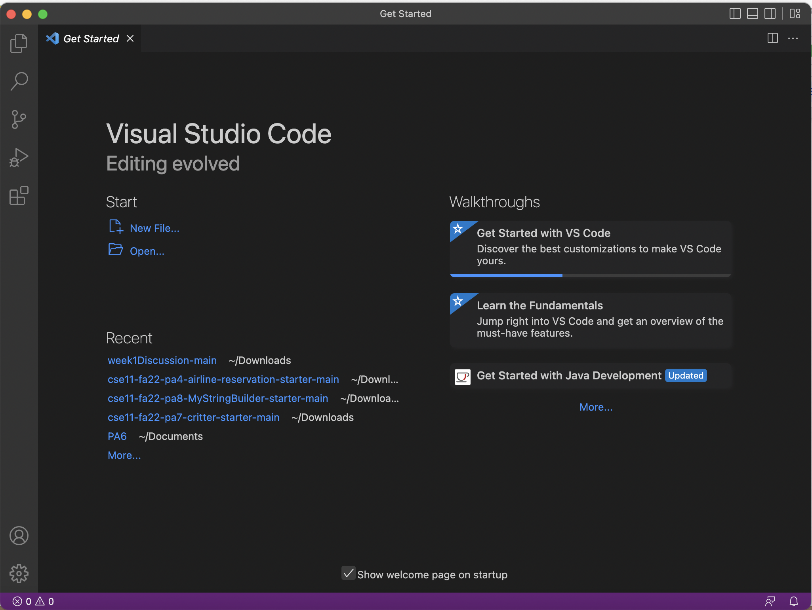
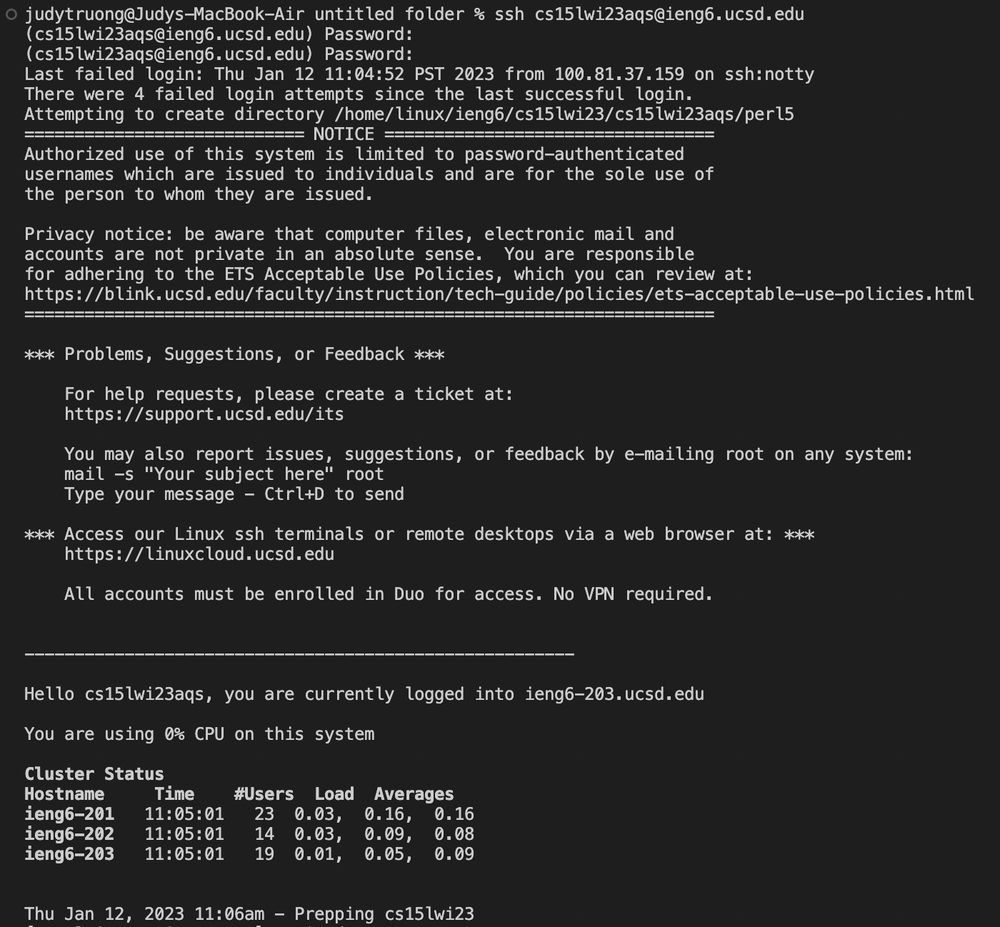
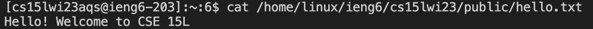

# Lab Report 1
On the first lab for CSE15L we were required to log into our course-specified account on ieng6. To make it more clear, ieng6, as I was told, was something that the students in CSE15L, or CSE students in general, would be frequently using. In order to log into said account we'd first have to install VS Code, which I already had installed from CSE 11. Once you open VS code it should look something like this..

Then create some empty file, open it onto VS Code and access or open its terminal by pressing the ~ (not shifted) and control key (Mac specific, this is what works for me. After the terminal is open you want to type or copy and paste `ssh cs15lwi23aqs@ing6.ucsd.edu` into the terminal. The 'aqs' portion is my course specific account and so these letters are different for others. After it gives me the option to enter my password. When you type your password it doesn't show on the terminal that you are typing, but you are. So after successfully logging in, it should look something like this.

There might've been a little more to what it should look like but I couldn't fit it all. That's most of what the beginning looks like, but afterwards you should be able to type in commands and it should run. This is an example of a command that I typed in.

