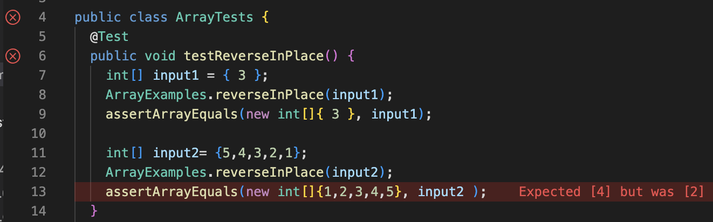

# Lab Report 2
## Part 1
In the 2nd lab, we created a search engine server, and I referenced that for this StringServer. I called it MessageBoard Server to make it more clear what it is. I created a string which would store all the messages. I essentially created a url path that would store the message from the url path and add onto a string. I also included a path to clear the messageboard.


```ruby
class Handler implements URLHandler {
    String message = "";

    public String handleRequest(URI url) {
        if (url.getPath().equals("/")) {
            return ("Message board cleared!");
        } 
        else {
            System.out.println("Path: " + url.getPath());
            if (url.getPath().contains("/add-message")) {
                String[] parameters = url.getQuery().split("=");
                if (parameters[0].equals("s")) {
                    message += parameters[1] + "\n";
                    return message;
                }
            }
            return "404 Not Found!";
        }
    }
}
```
Handle request is a method that is called, which also calls for other methods in Server.java to create and start a local server and to manage urls and their paths. HandleRequest takes the written path from the url (a variable) and executes the code, which was to store the first argument parameter into a string, then prints that onto the site. The only value that gets changed is the message variable. As the user adds more messages, the message grows longer because it is storing all the values that the user inputted from the site.
## Part 2
In the 3rd lab we practiced testing code using JUnit, and recognizing and fixing bugs. I will be referencing this reverseInPlace method for this part.
```  
static void reverseInPlace(int[] arr) {
    for(int i = 0; i < arr.length; i += 1) {
      arr[i] = arr[arr.length - i - 1];
    }
  }
```
These are some JUnit testers that are testing the code above.
```
	@Test 
public void testReverseInPlace() {
    int[] input1 = { 3 };
    ArrayExamples.reverseInPlace(input1);
    assertArrayEquals(new int[]{ 3 }, input1);
	}
    @Test 
public void testReverseInPlace() {
    int[] input2 = { 5, 4, 3, 2, 1 };
    ArrayExamples.reverseInPlace(input1);
    assertArrayEquals(new int[]{ 1, 2, 3, 4, 5 }, input2);
	}
```

The first tester passed, even though the code has a bug, while the second tester failed. **We know the first one passed because if it hadn't passed then there would've been an error or red bar highlighting the first 'assertEquals'.** The reason that the first test passed was because that array list's size was only one so expected outcome is whatever the input was, because the code essentially just replaces the data in the array's only index 0, with itself. However the second tester has a larger array size that is inputted. This test case fails because the code fails to reassign the beginning indicies to the last indices. The code only assigns the ending indicies to the beginning ones, and not vice versa. This happens because the for loop in the original code starts with replacing the beginning of the array, but once the number in the first few indices are changed, their previous numbers are deleted (not saved) and can not be used to assign the last indices. So because I've recognize that it does not save the first indices, I created an empty array that will be filled using a for loop. The for loop takes the original array's final index and sets that equal to the temporary array's first index. The for loop continues this pattern by moving one index closer to the middle.

```  
//Fixed Code
int[] tempStorage=new int[arr.length];
    int temp= arr.length;
    for(int i = 0; i < arr.length; i++) {
      tempStorage[i] = arr[--temp];
    }
    for (int i=0; i<arr.length; i++){
      arr[i]=tempStorage[i];
    }
```
In the fixed code, the for loop and temporary integer array fixes the reassignment issue. The buggy code did not store the original data before it was reassigned so it was not possible to access that previous data. However this loop solves the issue of not being able to access old data. It effectively just create a new array called 'tempStorage' and stores the data in the last index to the first index of this temporary array, then the i variable increases by one while the temp variable decreases by one. Finally the last for loop copies all the data in tempStorage to the original array.
## Part 3
These past labs taught me how to create a local web server that I can freely edit and customize. Mostly importantly however, I learned how JUnit works because previously I was very confused about how to write testers and how to read the errors. The labs gave me the chance to understand JUnit testing that I wasn't previously given.
