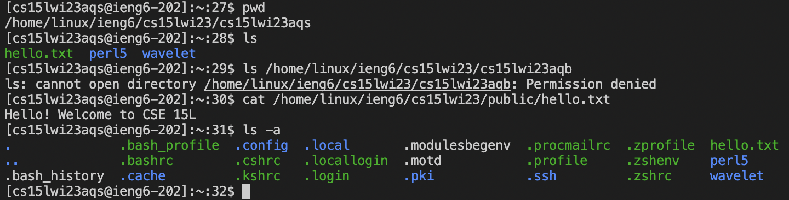

# Lab Report 2
## Part 1
In the 2nd lab, we created a search engine server, and I referenced that for this StringServer. I called it MessageBoard Server to make it more clear what it is. I created a string array which would store all the messages. I wasn't too sure how to exactly print the messages individually on a different line so I just printed out the array. I essentially created a url path that would store the message from the url path into an array that would also increase in size as more strings were added to it. I also included a path to clear the messageboard.

Then create some empty file, open it onto VS Code and access or open its terminal by pressing the ~ (not shifted) and control key (Mac specific, this is what works for me. After the terminal is open you want to type or copy and paste `ssh cs15lwi23aqs@ieng6.ucsd.edu` into the terminal. The 'aqs' portion is my course specific account and so these letters are different for others. After it gives me the option to enter my password. When you type your password it doesn't show on the terminal that you are typing, but you are. So after successfully logging in, it should look something like this.

There might've been a little more to what it should look like but I couldn't fit it all. That's most of what the beginning looks like, but afterwards you should be able to type in commands and it should run. These are examples of different commands I've typed in and what happens when they execute.

The first command I typed was `pwd` which details the path and directory I'm in. Afterwards I typed in `ls` which lists the content in the directory that I am in, which is cs15lwi23aqs. I then proceed to try to list out the content of another student's directory, but fail due to not having permissions. I then use `cat <path>` to print out the content of a specific file that I have access to. Finally I input `ls -a` which lists out all the content or files that start with '.' which `ls` excludes.
