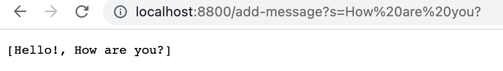
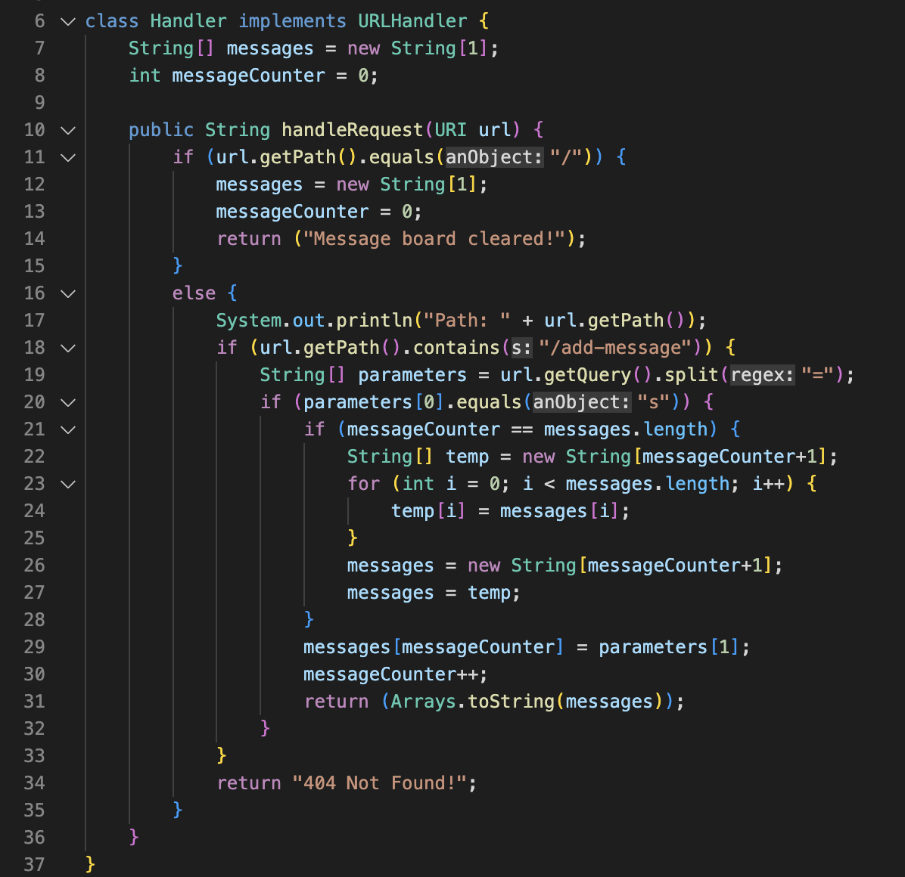

# Lab Report 2
## Part 1
In the 2nd lab, we created a search engine server, and I referenced that for this StringServer. I called it MessageBoard Server to make it more clear what it is. I created a string array which would store all the messages. I wasn't too sure how to exactly print the messages individually on a different line so I just printed out the array. I essentially created a url path that would store the message from the url path into an array that would also increase in size as more strings were added to it. I also included a path to clear the messageboard.



Handle request is a method that is called, which also calls for other methods in Server.java to create and start a local server and to manage urls and their paths. HandleRequest takes the written path from the url (a variable) and executes the code, which was to store the first argument parameter into an array, then print that onto the site. The url, array, and array size are the only variables that change. The add message request expands the size of the array and also stores that url parameter into the array.
## Part 2
In the 3rd lab we practiced testing code using JUnit, and recognizing and fixing bugs. 
```  
static void reverseInPlace(int[] arr) {
    for(int i = 0; i < arr.length; i += 1) {
      arr[i] = arr[arr.length - i - 1];
    }
  }
```
