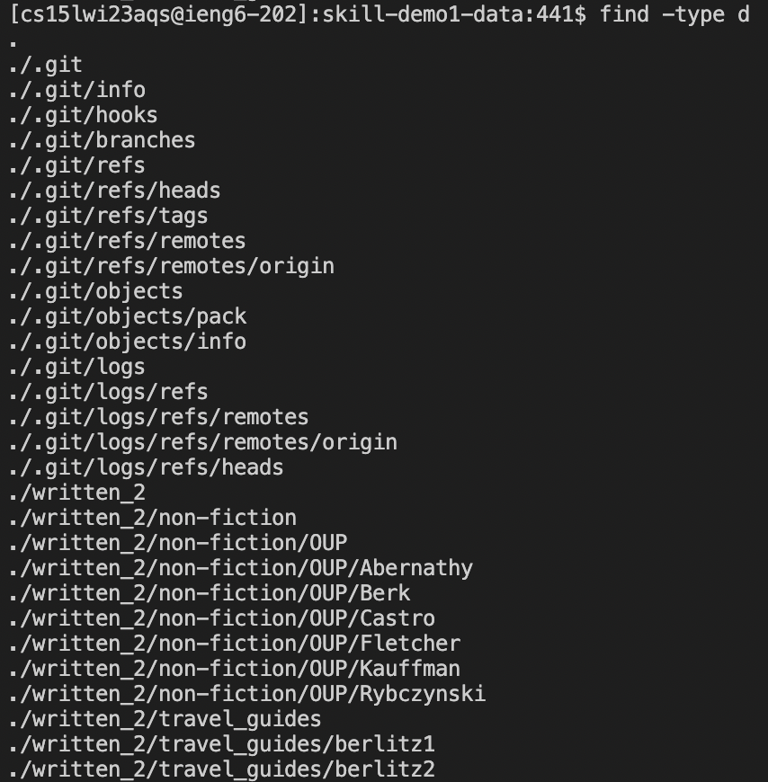
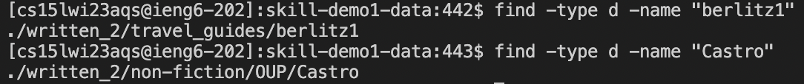
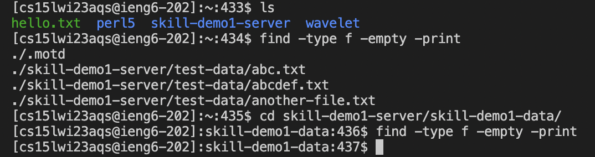
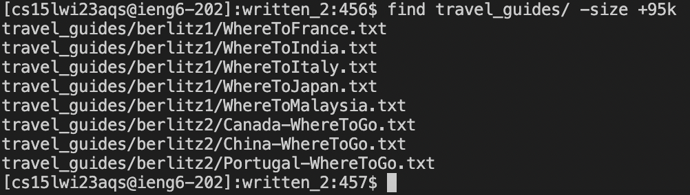
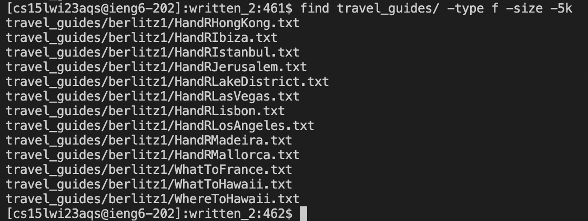
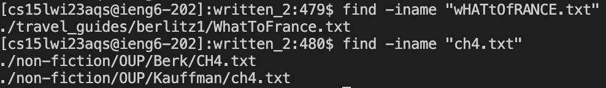
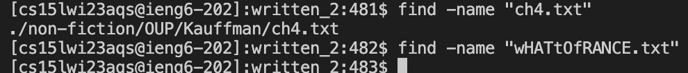

# Lab Report 3
## Researching Commands
I decided to research more command-line options for find. The first option I looked into was the `-type n` option. 'n' can be replaced with 'b', 'c', 'd', 'p', 'f', 'l', 's', and 'D'. For this example I'll just be using `-type d` because 'd' stands for directory and essentially the type option returns files of that type. So in these examples:

I first used the `find -type d` command to find all the possible directories in the written_2 directory. It then displays all the possible directories and their paths.

Then I used the type option to find a directory with a certain name. `find -type d -name "berlitz1"` was one command I ran, and it displays the path of the directory underneath. Suppose I had a file or something other than a directory named 'berlitz1', if I wanted to find the directory the type option allows me to do that easily.

In the next following examples I also used the type option, but with 'f' or files. However I am trying a different find command-line option which is empty.

For these examples, I used the following command `find -type f -empty -print` in my cs15lwi account or directory to find all possible empty files. I first tested the command in said directory because I knew there would be an empty file somewhere. I also attempted it in skill-demo1-data directory. Nothing printed however because all the files in the skill-demo1-data and its subdirectories have writtened .txt files.

The third find command-line option I looked more into was the `-size` option. Size returns me all the files that uses a specified amount of space. You can use 'b' for blocks, 'c' for bytes, 'w' for two-byte words, 'k' for kilobytes, 'M' for megabytes, and 'G' for gigabytes.

In this example, I used `find travel_guides/ -size +95` which resulted in serveral files being displayed that use up more than 95 kilobytes.

In this next one I used `find travel_guides/ -type f -size -5k` which displays all the files the use less than 5 kilobytes.

Finally I found an alternative `-name` find command-line option which is called `-iname`. `-iname` is essentially the same thing as -name, but instead it is case insensitive so that upper or lower case characters are not considered while finding files of the specified name.

In these examples I used `find -iname "wHATtOfRANCE.txt"` and `find -iname "ch.4txt"`. In the list command I was still able to find where the "WhatToFrance" text file although it was typed using the incorrect capital and lower case letters. And for the second command, because iname is case insensitive, it found two different text files that where chapter 4s. I also decided to include what would happen if I used the regular `-name` find command-line option in the image below.

