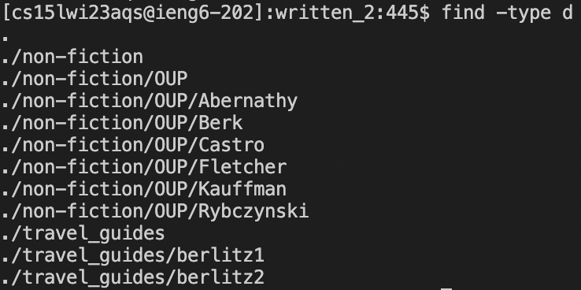

# Lab Report 3
## Researching Commands
I decided to research more command-line options for find. The first option I looked into was the `-type n` option. 'n' can be replaced with 'b', 'c', 'd', 'p', 'f', 'l', 's', and 'D'. For this example I'll just be using `-type d` because 'd' stands for directory and essentially the type option returns files of that type. So in these examples:

I first used the `find -type d` command to find all the possible directories in the written_2 directory. It then displays all the possible directories and their paths.

Then I used the type option to find a directory with a certain name. `find -type d -name "berlitz1"` was one command I ran, and it displays the path of the directory underneath. Suppose I had a file or something other than a directory named 'berlitz1', if I wanted to find the directory the type option allows me to do that easily.

In the next following examples I also used the type option, but with 'f' or files. However I am trying a different find command-line option which is empty.

For these examples, I used the following command `find -type f -empty -print` in my cs15lwi account or directory to find all possible empty files. I first tested the command in said directory because I knew there would be an empty file somewhere. I also attempted it in skill-demo1-data directory. Nothing printed however because all the files in the skill-demo1-data and its subdirectories have writtened .txt files.
